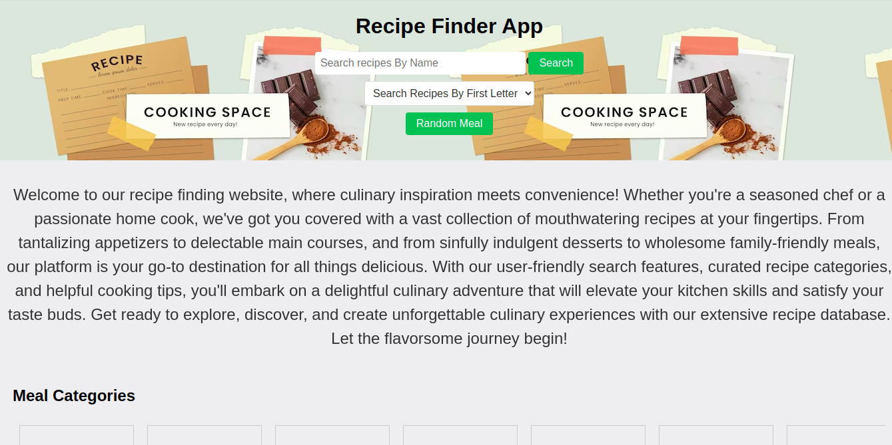

# Phase1-project
# Recipe Finder App

A web application for finding delicious recipes. Explore a vast collection of mouthwatering recipes, ranging from tantalizing appetizers to delectable main courses and sinfully indulgent desserts. This recipe-finding website offers a user-friendly interface, curated recipe categories, and helpful cooking tips to elevate your culinary experience.

## Preview

## Features
- Search recipes by name
- Search recipes by the first letter
- Random meal recipe generator
- Browse meal recipes by categories and areas
- Display detailed recipe instructions and ingredients

## Technologies Used
- HTML
- CSS
- JavaScript

## Getting Started
To get a local copy of this project up and running, follow these steps:

1. Clone this repository: `git clone https://github.com/Nganga-A/recipe-finder-app.git`
2. Navigate to the project directory: `cd recipe-finder-app`
3. Open the `index.html` file in your preferred browser.

## API Reference

This project utilizes the [TheMealDB API](https://www.themealdb.com/api.php) to fetch recipe data.

## Author

Created by [Abed Nganga Njuguna ](https://github.com/Nganga-A)

## License

This project is licensed under the [MIT License](LICENSE).
